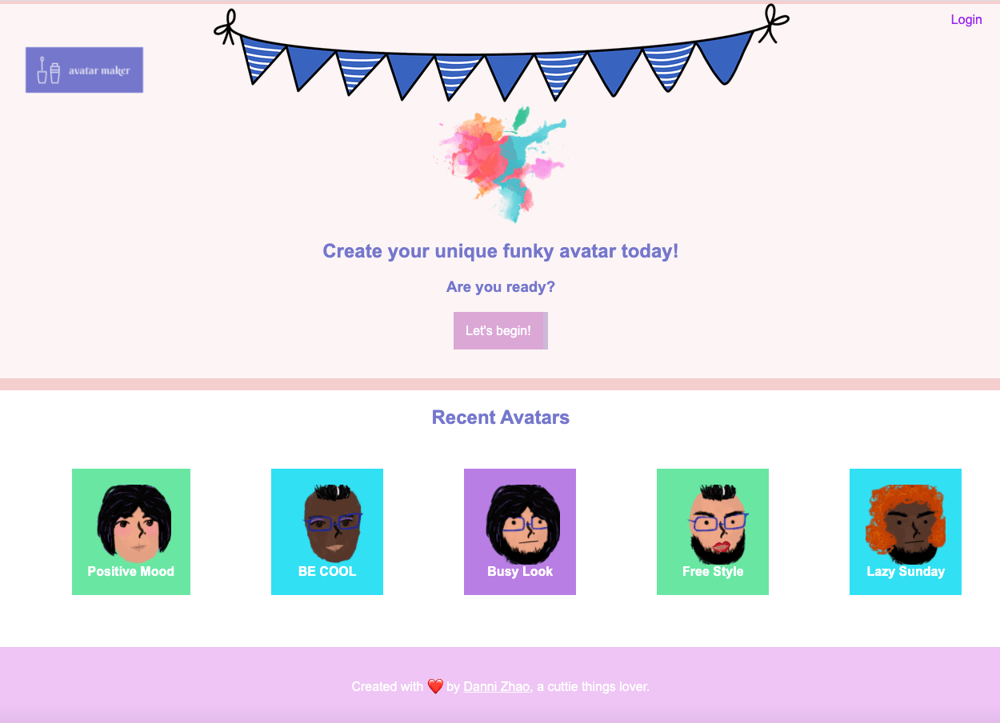

## Demo Project launched in AWS

This repository contains the demo project launching in AWS

## Project Explanation

Avatar Maker is an cartoon image builder assembling cute facial features together for enthusiasts. Users can create accounts, create avatars, and share them with others.

## Known Issues

None at this time.

Found one? Please let me know by opening an [issue](https://github.com/daneez/avatar-maker/issues)!

## License

All Images copyright Danni Zhao

All Code under MIT license
